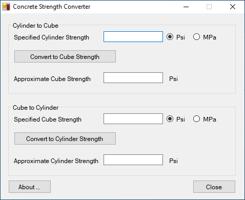
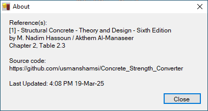

# Concrete_Strength_Converter
Converts strength of concrete from cylinder to cube and vice versa
  

## Screenshot

 

  
## Reference(s)
[1] - Structural Concrete - Theory and Design - Sixth Edition by M. Nadim Hassoun / Akthem Al-Manaseer
 

